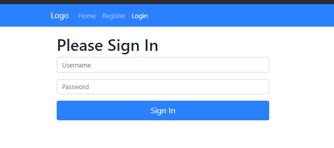
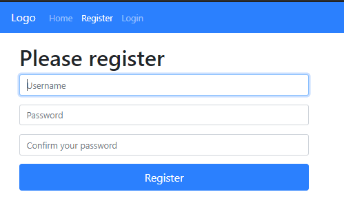
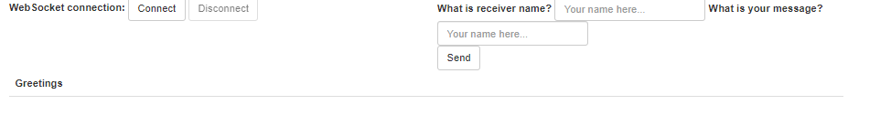
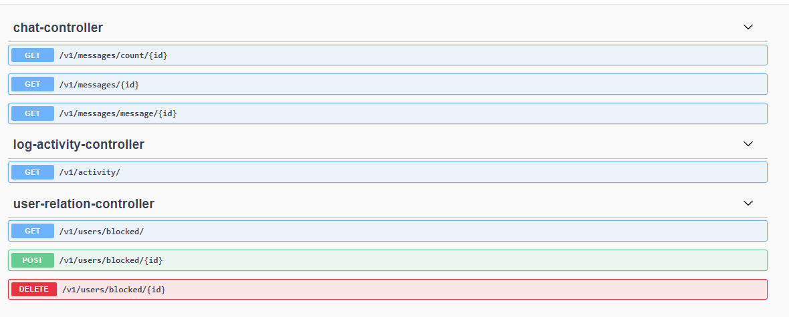

# Messaging Api
A messaging api case study application developed using Spring Boot, H2, Swagger. (Frontend side is not part of this application, they are only for testing purposes.)

## How to run
1. Build docker image:
    ```
    mvn spring-boot:build-image -Dspring-boot.build-image.imageName=messaging
    ```
2. Run docker image:
    ```
    docker run -p 9090:8080 -t docker.io/library/messaging:latest
    ```


## Screen shot

Login Page



Registration Page



Message Page



Swagger Page



## Next:

- Inmemory database can be easily replaced with persistant database.
- More test are needed.
- Refactor.